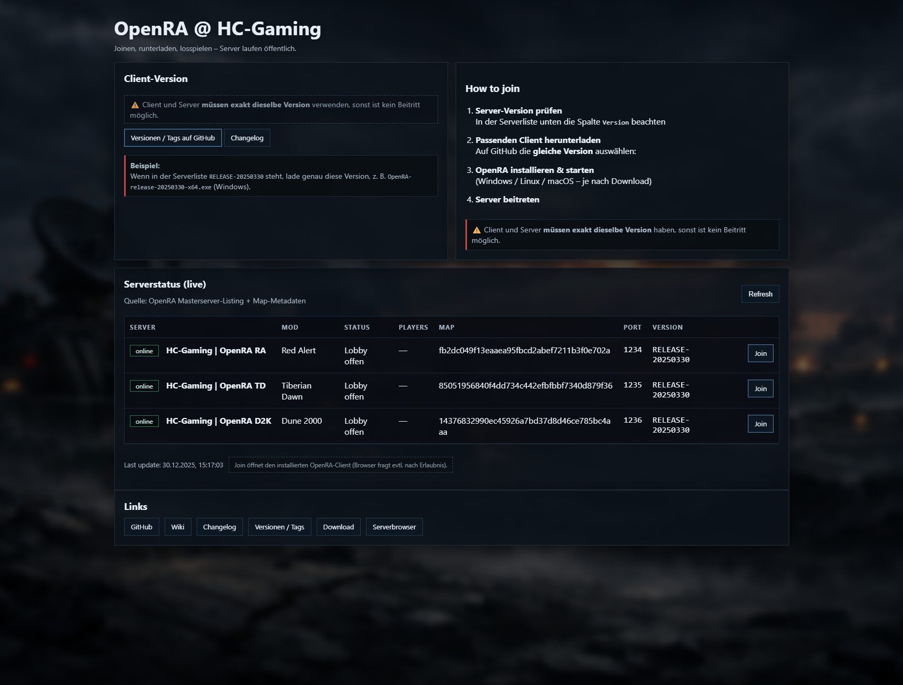

# OpenRA Multiserver Webpanel

Ein leichtgewichtiges, Docker-basiertes Webpanel zur öffentlichen Darstellung mehrerer **OpenRA Dedicated Server**  
inklusive Live-Status, Server-Versionen und Join-Funktion – **ohne Datenbank, ohne Auth, ohne Overhead**.

---

## 📸 Screenshot

> Beispielansicht des Webpanels:

screenshots/
└── webpanel-overview.png

## ✨ Features

- Live-Serverstatus (OpenRA Masterserver + Map-Metadaten)

- Unterstützung mehrerer Server:
	- Red Alert
	- Tiberian Dawn
	- Dune 2000

- Klare Anzeige von:
	- Mod
	- Status
	- Port
	- Server-Version

- „Join“-Button (öffnet lokalen OpenRA-Client)
- Klare Client-/Server-Versionserklärung
- Vollständig Dockerized
- Keine Datenbank
- Keine Authentifizierung
- Öffentliche Datenquellen

## 🗂 Projektstruktur

.
├── docker-compose.yml
├── README.md
├── screenshots/        # Screenshots fürs Repository
├── server/             # OpenRA Dedicated Server (RA / TD / D2K)
├── status/             # Status- & Aggregationslogik
└── web/                # Webpanel (HTML / CSS / JS)

## 🚀 Installation & Start
Voraussetzungen

- Docker
- Docker Compose (Plugin oder Standalone)
- Öffentliche Erreichbarkeit der Server-Ports

## Starten

![code]docker compose up -d

Danach ist das Webpanel unter der konfigurierten Domain erreichbar.

## 🎮 How to Join (für Spieler)

Server-Version prüfen
In der Serverliste die Spalte Version beachten
(z. B. RELEASE-20250330)

Passenden Client herunterladen
Auf GitHub exakt dieselbe Version auswählen:
https://github.com/OpenRA/OpenRA/tags

Beispiel (Windows):

OpenRA-release-20250330-x64.exe

OpenRA installieren & starten
(Windows / Linux / macOS – je nach Betriebssystem)

Server beitreten

Multiplayer → Internet

Nach HC-Gaming | OpenRA suchen

Oder direkt über den Join-Button im Webpanel

⚠️ Wichtig:
Client und Server müssen exakt dieselbe Version verwenden,
sonst ist kein Beitritt möglich.

## 🔄 Autorefresh

Der Serverstatus wird automatisch aktualisiert.
Das Intervall ist bewusst moderat gewählt (z. B. 5 Minuten),
um unnötige Last auf Masterserver und Browser zu vermeiden.

## 🔐 Sicherheit

Keine sensiblen Daten

Keine Tokens

Keine API-Keys

Keine Benutzerkonten

Keine Datenbank

Ausschließlich öffentlich verfügbare Datenquellen

## 📜 Lizenz / Hinweise

Dieses Projekt ist kein offizielles OpenRA-Projekt
und steht in keiner direkten Verbindung zum OpenRA-Team.

OpenRA selbst ist Open Source:
https://github.com/OpenRA/OpenRA

Der Code dieses Repositories steht unter der MIT License
(siehe LICENSE).

## ❤️ Danksagung

OpenRA Team & Community
für ein großartiges Open-Source-RTS-Projekt

OpenRA Masterserver
für die öffentliche Server- und Metadaten-API

Alle Community-Serverbetreiber, die OpenRA lebendig halten

## 💡 Motivation

Dieses Projekt entstand aus dem Wunsch,
mehrere OpenRA-Server transparent, stabil und nachvollziehbar
öffentlich darzustellen –
ohne unnötige Komplexität, ohne versteckte Logik, ohne Vendor-Lock-in.

Pull Requests, Issues und Forks sind ausdrücklich willkommen.

## 🏷 Version

v1.0.0 – Initial Release